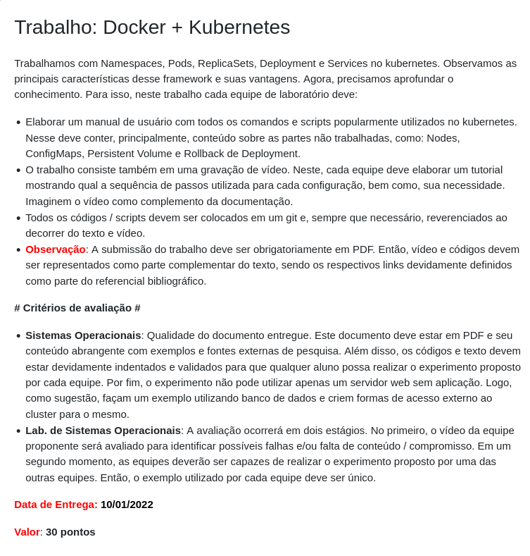

# Manual de Kubernetes

## Topicos
- [Nodes](https://github.com/Numb4r/KubernetesTutorial/blob/master/markdown/Nodes.md)
- [ConfigMaps](https://github.com/Numb4r/KubernetesTutorial/blob/master/markdown/ConfigMaps.md)
- [Persistent Volumes](https://github.com/Numb4r/KubernetesTutorial/blob/master/markdown/PersistentVolume.md)
- [Rollback de Deployment](https://github.com/Numb4r/KubernetesTutorial/blob/master/markdown/RollbackDeployment.md)

### [Tutorial de deploy de uma aplicação Node com um banco de dados.](https://github.com/Numb4r/KubernetesTutorial/blob/master/code/nodeapp/TutorialDeploy.md)

## Membros
- Alex Raimundo de Oliveira 
- Aline Silva Nunes 
- Diego Henrique Almeida 
- Gabriel Marcondes dos Santos
- Gabriel Mesquita Pereira
- Jorge Vitor Gonçalves de Souza 
- Marinêz Virgínia de Macedo Werneck Magalhães
- Victor Geraldo Faria Costa
- Yuri Dimitre Dias de Faria