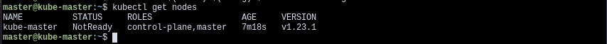

## Nodes

Nodes é um componente do Kubernetes que faz parte da hierarquia Master/Worker, na qual ele é um worker sendo controlado pelo control plane (Master). Em Kubernetes, essa dinâmica é renomeada para Master/Nodes.
 
Kubernetes roda a atividade proposta dentro de containers, que estes são colocados em Pods que rodam dentro de Nodes.Um Node pode conter  vários Pods, da mesma forma que um Pod pode conter vários containers. O Kubernetes control plane é responsável por dividir automaticamente a carga de Pods entre os Nodes do cluster.
 
Um Node por ser virtual, em conjunto ao control plane e outros Nodes, ou uma máquina física, sendo controlado via rede. Tipicamente, um cluster possui dezenas de Nodes.

\

A estrutura de um Node possui três principais componentes:
 
1. Kubelet: Gerenciador principal do Node, responsável por orquestrar os Pods atribuídos a ele. Além disso, ele é um agent end-point de comunicação entre Master e Nodes. é tarefa do kubelet comunicar ao Master caso um Pod caia.
2. Kube-proxy: Estrutura de proxy do Node para redirecionamento de network traffic. Responsável por conectar os serviços entre Nodes e o mundo externo.
3. Container runtime: Software responsável por rodar os containers. Docker é o mais comum container runtime.


### Gerenciamento 

É possível criar Node de duas formas possíveis: O kubelet em um  node self-register no control plane e manualmente por usuário.
 
É possível criar um Node especificando um JSON manifest com suas especificações. Esse objeto Node é criado internamente  dentro do kubernets e é checado se o kubelet foi registrado no API server (control plane). Caso a saúde do Node não seja boa, ou seja, todos os serviços estejam rodando, o Node é ignorado pelo cluster até que ele se torne saudável. Caso ele seja saudável, o Node poderá rodar Pods.


``` javascript
{
  "kind": "Node",
  "apiVersion": "v1",
  "metadata": {
    "name": "10.240.79.157",
    "labels": {
      "name": "my-first-k8s-node"
    }
  }
}
```

Os nomes são a forma de identificar cada Node, que devem ser únicos de cada um. Caso dois Nodes possuam o mesmo nome, o Kubernetes assumirá que são o mesmo objeto e possuem o mesmo estado (network, conteúdo de disco) e atributos.
 

### Criando um Cluster Multi-Node (Minikube)

É possível criar um demonstrativo de como é o comportamento de um cluster com multi nodes dentro do Minikube. Para isso execute ``minikube start --nodes 2 -p multinode-demo``. Esse comando ira criar um novo cluster e dentro dele dois Nodes.
 
Você pode visualizar todos os Nodes usando o comando ``kubectl get nodes``. Da mesma forma, você pode conferir o status de um Node usando o comando ``minikube status -p multinode-demo``


A flag ``-p`` indica uma mudança de profile do minikube. No caso acima, criamos um novo profile com o nome "multinode-demo". Sempre que for necessário a execução de algum comando do minikube que impacta em algum profile específico que não seja o default (minikube) é necessário informar pela flag em qual profile será executado. Após a criação do cluster, o ``kubectl`` irá usar o profile como padrão.
 
Usaremos o arquivo [hello-deployment.yaml](https://raw.githubusercontent.com/Numb4r/KubernetesTutorial/master/code/hello-deployment.yaml) para realizar um deployment que utilize os dois Nodes. Para isso utilizaremos o comando ``kubectl apply -f hello-deployment.yaml``. Podemos notar que foram criadas duas réplicas do mesmo deployment. Para que se tenha certeza que os Pods serão criados em Nodes distintos, declaramos na linha 22 do arquivo yaml a propriedade ``PodAntiAffinity`` em conjunto com ``requiredDuringSchedulingIgnoredDuringExecution``. Isso irá dizer para o Kubernetes apenas aplicar as regras na criação dos Pods. A propriedade ``labelSelector`` em conjunto com ``matchExpressions`` irá fazer a distinção entre um Node e outro, fazendo que as réplicas fiquem em Nodes diferentes.
 
Podemos usar o arquivo [hello-svc.yaml](https://raw.githubusercontent.com/Numb4r/KubernetesTutorial/master/code/hello-svc.yaml) para fazer um deploy de um servico que ira dividir as requisicoes IP feita pelo server entre os dois Nodes. Aplicamos o arquivo [hello-svc.yaml](https://raw.githubusercontent.com/Numb4r/KubernetesTutorial/master/code/hello-svc.yaml) pelo comando ``kubectl apply -f hello-svc.yaml``. Checamos o IP fornecido por esse serviço pelo comando ``minikube service list -p multinode-demo``


Com isso, podemos fazer uma requisição para o IP fornecido e verificar quais os Nodes são chamados. é possível conferir o IP interno de cada Pod pelo comando ``kubectl get pods -o wide``
 

 
Podemos ver que o Kubernetes acessa mais de um Node durante as requisições. Isso é feito com o intuito de balanceamento de carga.

## Criando um Cluster Multi-Node (Kubeadm)

Embora seja muito útil, a ferramenta Minikube é focada apenas em desenvolvimento e testes de forma local, não sendo recomendada a utilização em um ambiente real de uma aplicação. Para uma aplicação em produção, iremos utilizar a ferramenta ``Kubeadm``.
 
Iremos reproduzir o mesmo cenário do exemplo utilizando o Minikube, dois Nodes workers e um Master (control plane). Porém, iremos utilizar três máquinas virtuais para que seja emulado uma separação física entre os Nodes. Para a configuração da VM, iremos utilizar o Lubuntu 20.04 com 4 GB de memória, 2 cores de CPU e 30 GB de disco.

<!-- Alem disso, utilizaremos a rede em modo NAT, com um port fowarding na porta 3022 para o uso do ssh em uma maquina externa para facilitar a manipulacao das VMs. -->

<!-- [port fowarding](../images/2022-01-03_17:32:39.png) -->


Com as VMs instaladas e já configuradas, vamos ao processo de instalação do contêiner runtime e de todas as ferramentas necessárias para a execução do Kubernetes. Esse processo de instalação deve ser feito em todas as VMs. Como container runtime iremos utilizar o Docker. Para a instalacao do Docker basta executar ``curl -fsSL http://get.docker.com | sh`` no seu Shell de preferência. Ja as ferramentas do Kubernetes iremos utilizar o kubelet, kubeadm e kubectl. Para isso, basta executar o [script]() de instalação ou ``curl -fsSL link.com | sh``. Por fim, é necessário desativar a memória SWAP já que Kubernetes não trabalha com ela e podem ocorrer erros na manipulação de Pods. Para desativar o SWAP execute o comando ``sudo swapoff -a && sudo sed -i '/ swap / s/^/#/' /etc/fstab && sudo reboot``.
 
Depois de instalado as ferramentas, iremos configurar o Master e gerar o token de conexão. Para iniciar o control plane, utilize o comando ``kubeadm init`` como usuário root. O kubeadm irá gerar um token que será necessário para realizar a ligação entre o Master e os Workers.
 
 
[kubeadm init devolvendo o token](../images/2022-01-08_18:52:16.png)
 
Agora precisamos configurar o ``kubectl`` para acessar esse cluster criado. Para isso, o próprio comando ``kubeadm init`` nos dá a sequencia de comandos necessários:
```
mkdir -p $HOME/.kube
sudo cp -i /etc/kubernetes/admin.conf $HOME/.kube/config
sudo chown $(id -u):$(id -g) $HOME/.kube/config
 
```
 
Agora é possível conferir que foi criado um Node pelo comando ``kubectl get nodes``
 

 
Por fim, precisamos configurar um CNI (Container Network Interface) para que ocorra a  conexão entre os Pods. O Cluster DNS não irá funcionar até que um CNI seja inserido.
 
```
kubectl apply -f "https://cloud.weave.works/k8s/net?k8s-version=$(kubectl version | base64 | tr -d '\n')"
```
 
Após isso, o Node Master irá entrar em estado "Ready" e podemos configurar os outros Nodes.
 
Nas outras VMs, precisaremos realizar um port forwarding na porta 6443 para que seja possível a comunicação com o cluster. Utilizaremos a porta 6443.
Depois de configurado, executaremos o comando fornecido pelo ```kubeadm init`` para a adição dos Nodes ao cluster.
 
```
kubeadm join ip:port --token token \
       --discovery-token-ca-cert-hash sha256:hashtoken
```
 
<!-- kubeadm join 10.0.2.15:6443 --token tvz4uw.nkec782cjo4a5el7 \
       --discovery-token-ca-cert-hash sha256:f610c27d0f11b0e17a4ee9246f1146ec186dd149cea7a01f45e104e841112ffc -->
Após adicionados, é possível ver os Nodes pelo comando ``kubectl get nodes``.
 
 
### Troubleshooting
 
#### kubeadmn init nao inicializa por um erro do kubelet
 
Crie um documento no diretório /etc/docker/daemon.json e dentro coloque:
```
{
   "exec-opts": ["native.cgroupdriver=systemd"]
}
```
Após isso, reinicie os serviços do docker e do kubelet.
```
sudo systemctl daemon-reload
sudo systemctl restart docker
sudo systemctl restart kubelet
```
 


