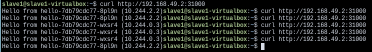

# Nodes

Nodes e' um componente do Kubernetes que faz parte da hierarquia Master/Worker, na qual ele e' um worker sendo controlado pelo control plane (Master). Em Kubernets, essa dinamica e' renomeada para Master/Nodes.

Kubernetes roda a atividade proposta dentro de containers, que estes sao colocados em Pods que rodam dentro de Nodes.Um Node pode conter  varios Pods, da mesma forma que um Pod pode conter varios conteiners. O Kubernetes control plane e' responsavel por dividir automaticamente a carga de Pods entre os Nodes no cluster.

Um Node por ser virtual, em conjunto ao control plane e outros Nodes, ou uma maquina fisica, sendo controlado via rede. Tipicamente, um cluster possui dezenas de Nodes.


A estrutura de um Node possui tres principais componentes:

1. Kubelet: Gerenciador principal do Node, responsavel por orquestrar os Pods atribuidos a ele. Alem disso ele e' um Agent end-point de comunicacao entre Master e Nodes. E' tarefa do kubelet comunicar ao Master caso um Pod caia.
3. Kube-proxy: Estrutura de proxy do Node para redirecionamento de network traffic. Responsavel por conectar os servicoes entre Nodes e ao mundo externo.
4. Container runtime: Software responsavel por rodar os containers. Docker e' o mais comum container runtime.


## Gerenciamento 

E' possivel criar Node de duas formas possiveis: O kubelet em um  node self-register no control plane e manualmente por usuario.

E' possivel criar um Node especificando um JSON manifest com suas especificacoes. Esse objeto Node e' criado internamente  dentro do kubernets e e' checado se o kubelet foi registrado no API server (control plane). Caso a saude do Node nao seja boa, ou seja, todos os servicoes estejam rodando, o Node e' ignorado pelo cluster ate que ele se torne saudavel. Caso ele seja saudavel, o Node podera' rodar Pods.

```javascript
{
  "kind": "Node",
  "apiVersion": "v1",
  "metadata": {
    "name": "10.240.79.157",
    "labels": {
      "name": "my-first-k8s-node"
    }
  }
}
```

Os nomes sao a forma de identificar cada Node, que devem ser unicos de cada um. Caso dois Nodes possuam o mesmo nome, o Kubernetes assumira que sao o mesmo objeto e possuem o mesmo estado (network, conteudo de disco) e atributos. 


### Criando um Cluster Multi-Node (Minikube)

E' possivel criar um demonstrativo de como e' o comportamento de um cluster com multinodes dentro do Minikube. Para isso execute ``minikube start --nodes 2 -p multinode-demo``. Esse comando ira criar um novo cluster e dentro dele dois nodes. 

Voce pode visualizar todos os Nodes usando o comando ``kubectl get nodes``. Da mesma forma, voce pode conferir o status de um Node usando o comando ``minikube status -p multinode-demo``


A flag ``-p`` indica uma mudanca de profile do minikube. No caso acima, criamos um novo profile com o nome "multinode-demo". Sempre que seja necessario a execucao de algum comando do minikube que impacta em algum profile especifico que nao seja o default (minikube) e' necessario informar pela flag em qual profile sera executado. Apos a criacao do cluster, o ``kubectl`` ira usar o profile como padrao.

Usaremos o arquivo [hello-deployment.yaml](../code/hello-deployment.yaml) para realizar um deployment que utilize os dois Nodes. Para isso utilizaremos o comando ``kubectl apply -f hello-deployment.yaml``. Podemos notar que serao criadas duas replicas do mesmo deployment. Para que se tenha certeza que os Pods serao criados em Nodes distintos, declaramos na linha 22 do arquivo yaml a propriedade ``PodAntiAffinity`` em conjunto com ``requiredDuringSchedulingIgnoredDuringExecution``. Isso ira dizer para dizer para o Kubernetes apenas aplicar as regras na criacao dos Pods. A propriedade ``labelSelector`` em conjunto com ``matchExpressions`` ira fazer a dinstincao entre um Node e outro, fazendo que as replicas fiquem em Nodes diferentes.

Podemos usar o arquivo [hello-svc.yaml](../code/hello-svc.yaml) para fazer um deploy de um servico que ira dividir as requisicoes IP feita pelo server entre os dois Nodes. Aplicamos o arquivo [hello-svc.yaml](../code/hello-svc.yaml) pelo comando ``kubectl apply -f hello-svc.yaml``. Checamos o IP fornecido por esse servico pelo comando ``minikube service list -p multinode-demo`` 


Com isso, podemos fazer uma requisicao para o IP fornecido e verificar quais os Nodes sao chamados. E' possivel conferir o IP interno de cada Node pelo comando ``kubectl get pods -o wide``



Podemos ver que o Kubernetes acessa mais de um Node durante as requisicoes. Isso e' feito com o intuito de balanceamento de carga.